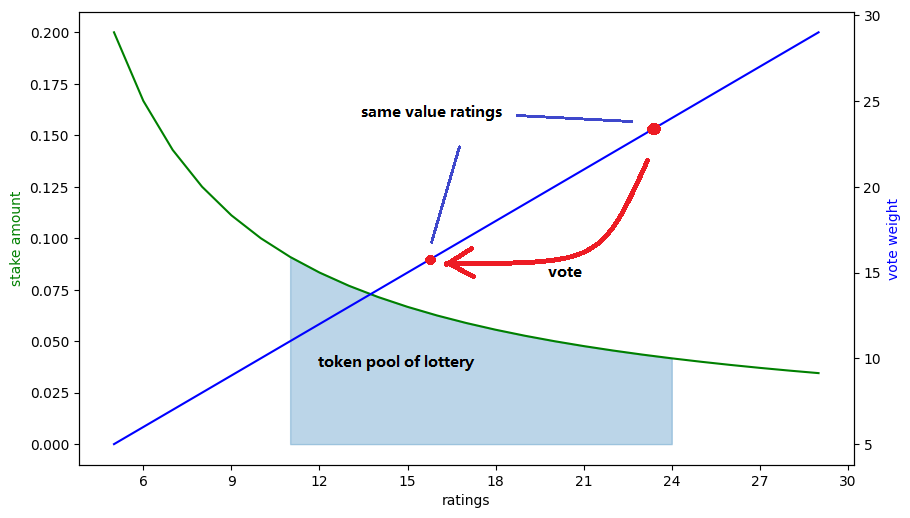
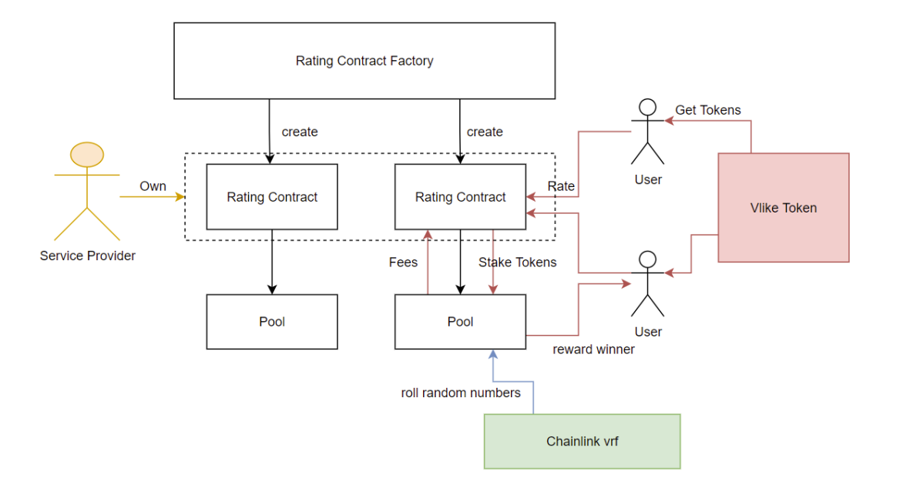

# Vlike: A decentralized rating system

*We like, or we dislike. We don't hide.*

---

Vlike is the proof of concept of a decentralized rating system.
Please check this [gitbook](https://chench53.gitbook.io/hackathon/) for more details. View our demo [Vlike](http://vlike.frontiech.com/) deployed on rinkeby testnet.


 
## Project structure

```
| README.md
|-contracts
  | README.md
  | .env
  |-contracts
  |-interfaces
  |-scipts
  |...
|-frontend
  | README.md
  | env
  | env.local
  |-public
  |-src
  | ...
```

- contracts: 
    - brownie
- frontend:
    - react
    - web.js

## Development

To start developing locally, please:

1. Open the Brownie console. It launches a ganache process locally on localhost:8545. In /contracts, run

    `brownie console`

2. Deployed contracts on local testnet. In the brownie console, run

    `run('scripts/deploy')`

    It would write a `.env.development.local` file in /frontend with the addresses of contracts.

3. Run frontend in the development mode. In /frontend: 

    `npm start`

    Open [http://localhost:3000](http://localhost:3000) to view it in the browser.

4. Connect wallet to local:8545, import some ganache generated test accounts into MetaMask.

Then you can interact with local contracts in this local web page.


## Deployment

To deploy this project:

1. Deployed Rating contact on rinkeby testnet. In /contracts: 

    `brownie run .\scripts\deploy.py  --network rinkeby`

    It would write a `.env.production.local` file in /frontend with the addresses of contracts on rinkeby.

3. Build frontend to the /frontend folder:

    `npm run build`

    Serve files in /frontend/build on a web server.


## Vlike Token

The service provider can decide whether or not to enable tokens in their application.The incentive of this token is: that it encourages viewers to give good feedback. 

We implement a random periodic lottery for every item/content that can be rated. This is roughly how it works:

1. A viewer pays a certain amount of tokens every time a viewer gives a rating. The tokens this rater paid will be transferred into a pool. The earlier raters pay more than the later ones.

2. In the meantime, the rater will vote a certain weight to a random rater who has the same rating as the latter one. The later raters have a higher vote weight.

3. Roll a random number to decide when the lottery ends. Choose the winner base on the raters' votes they have received. The tokens in the pool will be transferred to the winner. The service provider can charge a certain percentage of fees.

4.  Restart this lottery for another round.



## Contracts

- Vlike Token, the ERC20 token contract
- Rating Contract Factory, the factory contract can create new rating contract.
- Rating Contract, the Contact keep track of users' rating data.
- Pool, the token pool of a rating contract.


